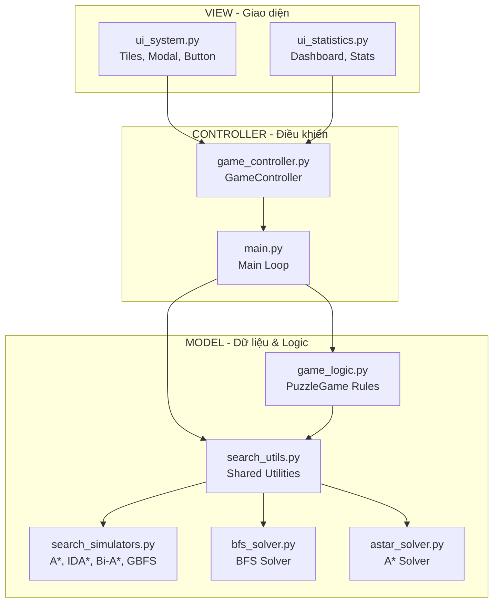

# 8puzzleNhom5
# 8-Puzzle AI Solver - Trình mô phỏng và so sánh các thuật toán tìm kiếm

## Mục lục

1. [Giới thiệu](#giới-thiệu)
2. [Các thuật toán sử dụng](#các-thuật-toán-sử-dụng)
3. [Giao diện chương trình](#giao-diện-chương-trình)
4. [Cài đặt và chạy dự án](#cài-đặt-và-chạy-dự-án)
5. [Các tính năng](#các-tính-năng)

---

## Giới thiệu

Bài toán 8-Puzzle là một dạng bài toán tìm kiếm cổ điển trong Trí tuệ nhân tạo. Mục tiêu là sắp xếp lại các mảnh ghép trên một ma trận 3x3 (gồm 8 ô số và 1 ô trống) từ một trạng thái xáo trộn bất kỳ đưa về trạng thái đích.

### Cách làm

Dự án được xây dựng mô phỏng trực quan bằng ngôn ngữ **Python** kết hợp với thư viện đồ họa **Pygame**:

- **Cấu trúc dữ liệu**: Sử dụng mảng 1 chiều để biểu diễn trạng thái bàn cờ.
- **Quản lý trạng thái**: Sử dụng Stack để theo dõi lịch sử nước đi, hỗ trợ Undo/Redo.
- **Hệ thống đánh giá khởi tạo**: Áp dụng kiểm tra **Số nghịch thế (Inversions)** để đảm bảo trạng thái có lời giải.

### Kiến trúc dự án (Architecture Model)



---

## Các thuật toán sử dụng

Dự án triển khai các thuật toán sau để giải quyết bài toán 8-Puzzle:

### 1. BFS (Breadth-First Search)

Thuật toán tìm kiếm theo chiều rộng, đảm bảo tìm được lời giải tối ưu.

### 2. A* (A-Star)

Sử dụng hàm heuristic Manhattan Distance để hướng tới giải pháp tối ưu.

### 3. Bi-directional A*

Chạy A* từ cả trạng thái ban đầu và đích, gặp nhau để tăng tốc độ.

### 4. IDA* (Iterative Deepening A*)

Kết hợp A* với DFS, sử dụng ngưỡng f-cost tăng dần.

### 5. GBFS (Greedy Best-First Search)

Ưu tiên mở rộng node gần goal nhất theo heuristic.

### 6. A* với Misplaced Tiles

Sử dụng đếm số ô sai vị trí làm hàm heuristic thay thế Manhattan.

---

## Giao diện chương trình

Dưới đây là thiết kế giao diện và kiến trúc của ứng dụng 8-Puzzle. Tương tác có thể chạy trực tiếp bằng lệnh `python main.py`.

### Khung Bản Thiết Khế (Wireframe)

Quy hoạch giao diện theo khu vực. Các chức năng điều khiển trò chơi nằm ở sidebar, và bảng Puzzle kích thước lớn nằm giữa làm tâm điểm.


### Trạng Thái Mô Phỏng Giao Diện

- Bảng trạng thái Undo/Redo và các thao tác chuột kéo thả ghép mảnh đã có thể tương tác.
- Dashboard hiển thị thông số trực tiếp từ các thuật toán.


---

## Cài đặt và chạy dự án

**Yêu cầu hệ thống:**
- **Python**: Phiên bản 3.10 trở lên
- **Thư viện**: 
  - `pygame-ce`
  - `Pillow`

**Các bước chạy:**

```bash
# Tạo môi trường ảo
python -m venv .venv

# Kích hoạt môi trường
# Windows: .venv\Scripts\activate
# macOS/Linux: source .venv/bin/activate

# Cài đặt thư viện
pip install -r requirements.txt

# Chạy ứng dụng
python main.py
```