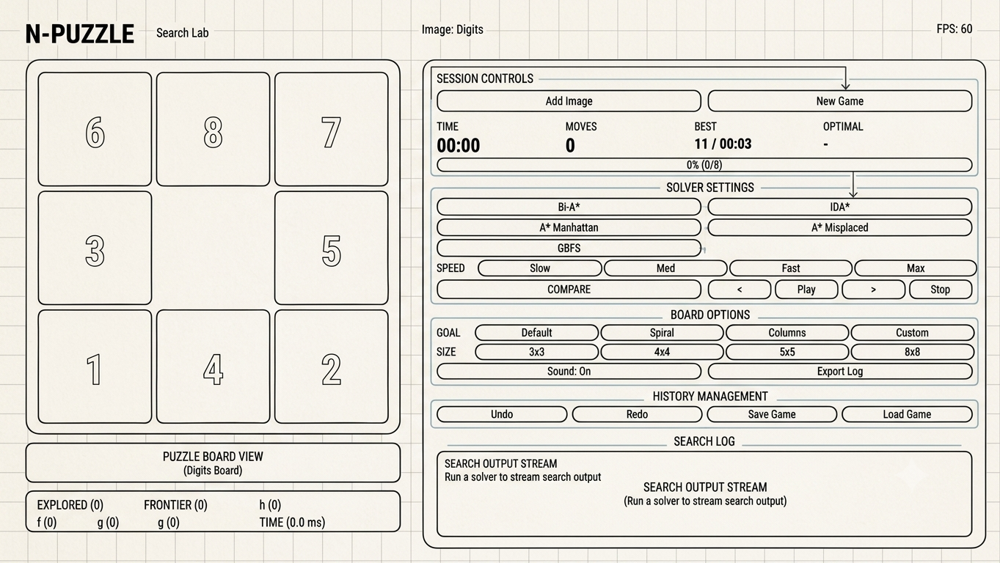
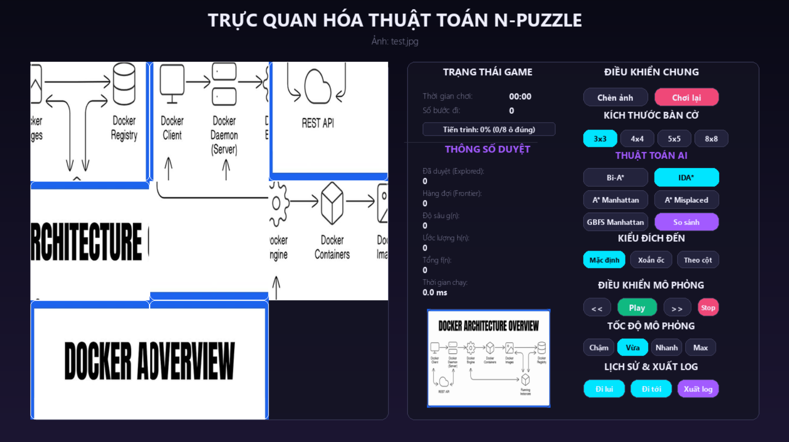
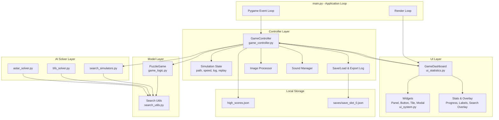
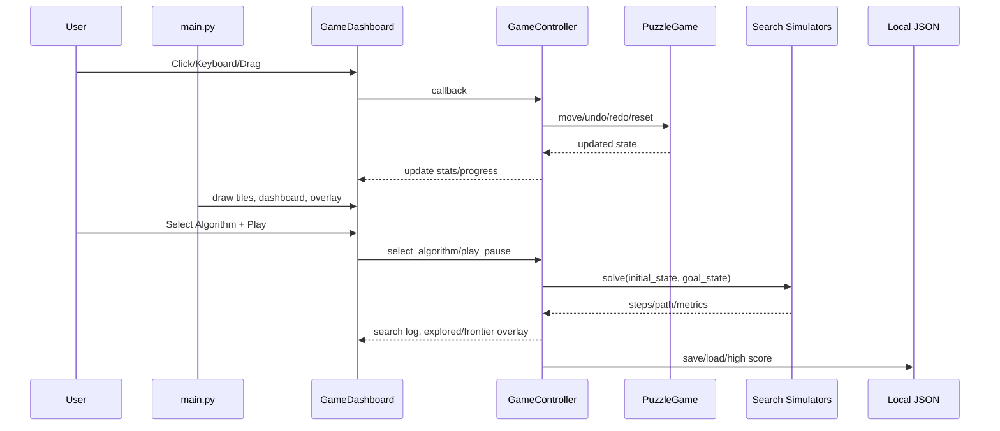
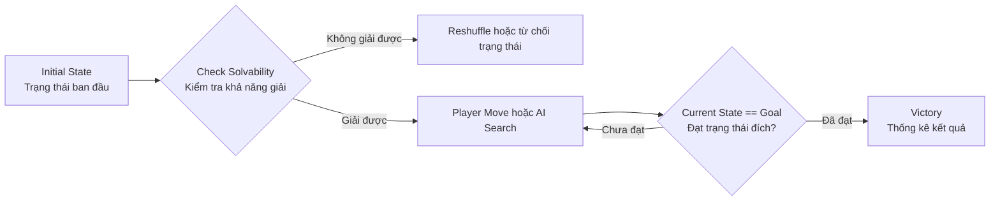

# 8-Puzzle AI Solver - N-Puzzle Search Algorithm Simulator

## 1. Tên Dự Án

**8-Puzzle AI Solver - N-Puzzle Search Algorithm Simulator**

Giới thiệu ngắn gọn: Dự án là một trò chơi N-Puzzle viết bằng Python và Pygame, cho phép người dùng giải puzzle thủ công hoặc quan sát các thuật toán tìm kiếm AI giải bàn cờ theo từng bước. Ứng dụng hỗ trợ nhiều kích thước bàn cờ, nhiều trạng thái đích, so sánh thuật toán, tải ảnh puzzle, lưu/load ván chơi và thống kê hiệu năng tìm kiếm.

Trạng thái dự án: **Đang phát triển (In Progress)**.

Ảnh minh họa:





---

## 2. Mục Lục

- [1. Tên Dự Án](#1-tên-dự-án)
- [2. Mục Lục](#2-mục-lục)
- [3. Tính Năng Nổi Bật](#3-tính-năng-nổi-bật)
- [4. Kiến Trúc Hệ Thống](#4-kiến-trúc-hệ-thống)
- [5. Kiến Thức Nền Tảng Về N-Puzzle](#5-kiến-thức-nền-tảng-về-n-puzzle)
- [6. Yêu Cầu Hệ Thống](#6-yêu-cầu-hệ-thống)
- [7. Hướng Dẫn Cài Đặt & Chạy](#7-hướng-dẫn-cài-đặt--chạy)
- [8. Cách Sử Dụng](#8-cách-sử-dụng)
- [9. Đóng Góp](#9-đóng-góp)
- [10. Cấp Phép & Thông Tin Liên Hệ](#10-cấp-phép--thông-tin-liên-hệ)

---

## 3. Tính Năng Nổi Bật

- **Chơi N-Puzzle thủ công:** di chuyển ô bằng chuột, kéo thả hoặc phím mũi tên.
- **Nhiều kích thước bàn cờ:** hỗ trợ 3x3, 4x4, 5x5 và 8x8.
- **Nhiều trạng thái đích:** default, spiral, columns và chế độ custom/cycle preset.
- **AI solvers:** BFS, A* Manhattan, A* Misplaced Tiles, IDA*, GBFS và Bi-directional A*.
- **Mô phỏng từng bước:** chạy, tạm dừng, tiến/lùi từng bước và replay lời giải.
- **So sánh thuật toán:** hiển thị số node đã duyệt, số bước di chuyển và thời gian xử lý của từng thuật toán.
- **Dashboard thống kê:** theo dõi FPS, thời gian chơi, số nước đi, điểm tốt nhất, tiến độ đúng ô, frontier, explored nodes, h-score, f-score.
- **Tải ảnh puzzle:** dùng ảnh cá nhân để tạo các tile puzzle theo kích thước bàn cờ.
- **Âm thanh:** hiệu ứng move, victory và error.
- **Lưu/load ván chơi:** lưu trạng thái bàn cờ, thời gian, thuật toán, tốc độ và ảnh đang dùng vào thư mục `saves/`.
- **Export solution log:** xuất file `.txt` mô tả từng bước di chuyển của lời giải AI.
- **Kiểm tra thử nghiệm:** có các script kiểm tra logic game, solver và goal preset.

---

## 4. Kiến Trúc Hệ Thống

Dự án sử dụng kiến trúc MVC-inspired:

- **Main Loop:** `main.py` đảm nhiệm vòng lặp Pygame, nhận event, cập nhật trạng thái và render giao diện.
- **Controller:** `GameController` giữ trạng thái game, xử lý callback từ UI, điều khiển solver, lưu/load, xuất log, high score và âm thanh.
- **View:** `GameDashboard`, `ui_system.py` và `ui_statistics.py` chịu trách nhiệm vẽ panel, button, tile, modal, progress bar, thống kê và overlay tìm kiếm.
- **Model:** `PuzzleGame` quản lý luật chơi, trạng thái bàn cờ, undo/redo, solvability, goal preset và tiến độ.
- **AI Solver Layer:** `search_simulators.py`, `astar_solver.py`, `bfs_solver.py` và `search_utils.py` triển khai các thuật toán tìm kiếm.
- **Hạ tầng phụ trợ:** `image_processor.py`, `sound_manager.py`, `high_scores.json` và thư mục `saves/`.



Luồng xử lý chính khi người dùng tương tác với bàn cờ:



---

## 5. Kiến Thức Nền Tảng Về N-Puzzle

### 5.1 Tổng quan về N-Puzzle

N-Puzzle là bài toán sliding puzzle trên lưới kích thước `N x N`, gồm `N*N - 1` ô có số và 1 ô trống. Phiên bản phổ biến nhất là **8-Puzzle** với lưới `3x3`, gồm 8 ô số và 1 ô trống.

Mục tiêu của trò chơi là biến đổi một trạng thái ban đầu bị xáo trộn về trạng thái đích bằng cách trượt các ô kề ô trống. Trong dự án này, mỗi trạng thái bàn cờ được biểu diễn bằng một mảng 1 chiều, ví dụ trạng thái chuẩn của 8-Puzzle:

```text
[1, 2, 3,
 4, 5, 6,
 7, 8, 0]
```

Trong đó `0` đại diện cho ô trống nằm ở góc phải dưới.

Luồng hoạt động cơ bản của N-Puzzle:



### 5.2 Nguyên lý hoạt động của N-Puzzle

- **Biểu diễn trạng thái:** Bàn cờ được lưu dưới dạng mảng 1 chiều. Chỉ số mảng tương ứng với vị trí ô trong lưới `N x N`.
- **Ô trống:** Giá trị `0` đại diện cho ô trống. Chỉ các ô kề ô trống theo chiều ngang hoặc dọc mới có thể di chuyển.
- **Nước đi hợp lệ:** Khi người dùng chọn một ô kề ô trống, chương trình hoán đổi vị trí của ô đó với ô trống.
- **Kiểm tra thắng:** Sau mỗi nước đi, trạng thái hiện tại được so sánh với `goal_state`. Nếu trùng nhau, ván chơi kết thúc.
- **Undo/Redo:** Lịch sử nước đi được lưu trong `history`, các trạng thái bị undo được đưa vào `redo_stack`.
- **Tính giải được:** Dự án kiểm tra số nghịch thế để đảm bảo trạng thái sinh ra có lời giải.
- **Heuristic:** Các thuật toán AI sử dụng hàm đánh giá như Manhattan Distance hoặc Misplaced Tiles để ước lượng khoảng cách tới đích.
- **Search algorithms:** BFS tìm lời giải tối ưu theo số bước, A* dùng heuristic để giảm số node cần duyệt, IDA* tiết kiệm bộ nhớ, GBFS ưu tiên node gần đích, Bi-A* tìm từ hai phía.

Ví dụ một nước đi hợp lệ:

```text
Trạng thái gần đích:
[1, 2, 3,
 4, 5, 6,
 7, 8, 0]

Nếu ô trống nằm ở giữa:
[1, 2, 3,
 4, 0, 6,
 7, 5, 8]

Ô số 5 bên dưới ô trống có thể trượt lên:
[1, 2, 3,
 4, 5, 6,
 7, 0, 8]
```

---

## 6. Yêu Cầu Hệ Thống

Cần cài đặt trước khi chạy dự án:

- **Hệ điều hành:** Windows/macOS/Linux.
- **Python:** 3.10 trở lên. Dự án hiện đang chạy với Python 3.12.
- **Package manager:** `pip`.
- **Thư viện Python:**
  - `pygame-ce`
  - `Pillow`
- **Cơ sở dữ liệu:** Không yêu cầu database. Dữ liệu local như điểm cao và save game được lưu bằng JSON trong thư mục dự án.

---

## 7. Hướng Dẫn Cài Đặt & Chạy

### 7.1 Clone hoặc tải project

```bash
git clone <url-repo-cua-ban>
cd 8-Puzzle-Game-1.0
```

Nếu không dùng Git, chỉ cần copy toàn bộ thư mục project về máy và mở terminal tại thư mục gốc.

### 7.2 Tạo và kích hoạt môi trường ảo

Trên Windows:

```bash
python -m venv .venv
.venv\Scripts\activate
```

Trên macOS/Linux:

```bash
python3 -m venv .venv
source .venv/bin/activate
```

### 7.3 Cài đặt dependencies

```bash
pip install -r requirements.txt
```

### 7.4 Cấu hình file môi trường

Dự án hiện **không yêu cầu file `.env`** và không có biến môi trường bắt buộc.

Nếu muốn chạy với ảnh puzzle cá nhân, chỉ cần chọn ảnh qua nút **Add Image** trong giao diện. Nếu muốn lưu ván chơi, thư mục `saves/` sẽ được tạo tự động khi nhấn **Save Game**.

### 7.5 Chạy ứng dụng

```bash
python main.py
```

### 7.6 Chạy kiểm tra nhanh

```bash
python tests/test_features.py
```

Các script kiểm tra goal preset:

```bash
python tests/test_spiral.py
python tests/test_columns.py
```

### 7.7 Đóng gói optional

Nếu muốn build file `.exe` bằng PyInstaller:

```bash
pyinstaller main.spec
or
pyinstaller --onefile --windowed main.py
```

File build sẽ nằm trong thư mục `dist/`.

---

## 8. Cách Sử Dụng

### 8.1 Chơi thủ công

1. Chạy ứng dụng:

```bash
python main.py
```

2. Click vào ô nằm cạnh ô trống để di chuyển ô đó vào ô trống.
3. Hoặc kéo một ô kề ô trống rồi thả vào ô trống.
4. Sử dụng phím mũi tên để di chuyển nhanh.
5. Dùng **Undo** / **Redo** để quay lại hoặc làm lại nước đi.

### 8.2 Chạy AI solver

Trong panel điều khiển bên phải:

1. Mở mục **ALGORITHMS**.
2. Chọn một thuật toán:
   - **Bi-A***
   - **IDA***
   - **A* Manhattan**
   - **A* Misplaced**
   - **GBFS**
3. Chọn tốc độ mô phỏng: **Slow**, **Med**, **Fast** hoặc **Max**.
4. Nhấn **Play** để chạy lời giải hoặc **>** để tiến từng bước.
5. Nhấn **Stop** để dừng mô phỏng.

### 8.3 So sánh thuật toán

Nhấn **Compare All** để chạy nhiều thuật toán trên cùng một trạng thái bàn cờ. Kết quả hiển thị trong modal gồm:

- Tên thuật toán.
- Số node đã duyệt.
- Số bước di chuyển trong lời giải.
- Thời gian xử lý.

### 8.4 Đổi kích thước bàn cờ

Mở mục **SETTINGS**, chọn kích thước:

- 3x3
- 4x4
- 5x5
- 8x8

Ứng dụng sẽ tự tạo lại bàn cờ và tile UI tương ứng.

### 8.5 Đổi trạng thái đích

Trong **SETTINGS > Goal**, chọn:

- **Default:** trạng thái chuẩn `[1, 2, 3, ..., 0]`.
- **Spiral:** trạng thái đích xoắn ốc.
- **Columns:** trạng thái đích theo cột.
- **Custom:** cycle qua các preset goal hiện có.

### 8.6 Tải ảnh puzzle

1. Nhấn **Add Image**.
2. Chọn ảnh `.png`, `.jpg`, `.jpeg` hoặc `.webp`.
3. Ảnh sẽ được resize và cắt thành các tile theo kích thước bàn cờ hiện tại.

### 8.7 Lưu và tải ván chơi

- Nhấn **Save Game** để lưu ván hiện tại vào `saves/save_slot_0.json`.
- Nhấn **Load Game** để tải lại ván đã lưu.
- Phím tắt:
  - `Ctrl + S`: lưu game.
  - `Ctrl + L`: tải game.

### 8.8 Xuất log lời giải

Sau khi AI tìm được lời giải, nhấn **Export Log** để lưu file `.txt` mô tả từng bước di chuyển, thuật toán đã dùng, trạng thái bắt đầu, trạng thái đích và tổng số bước.

---

## 9. Đóng Góp

Mọi người có thể đóng góp bằng cách thêm tính năng mới, cải thiện UI, tối ưu thuật toán hoặc bổ sung kiểm thử.

Quy trình đề xuất:

1. Fork repository về tài khoản cá nhân.
2. Tạo branch mới từ branch chính:

```bash
git checkout -b feature/ten-tinh-nang
```

3. Thực hiện thay đổi và kiểm tra ứng dụng chạy ổn định.
4. Chạy kiểm tra nhanh nếu có thay đổi logic:

```bash
python test_features.py
```

5. Commit thay đổi với message rõ ràng.
6. Push branch lên fork.
7. Mở Pull Request về repository chính và mô tả ngắn gọn nội dung đã thay đổi.

---

## 10. Cấp Phép & Thông Tin Liên Hệ

**License:** Chưa được chỉ định trong repository. Nếu bạn là tác giả, hãy bổ sung file `LICENSE` để làm rõ điều khoản sử dụng.

**Contact:** Chưa có thông tin liên hệ chính thức trong codebase.